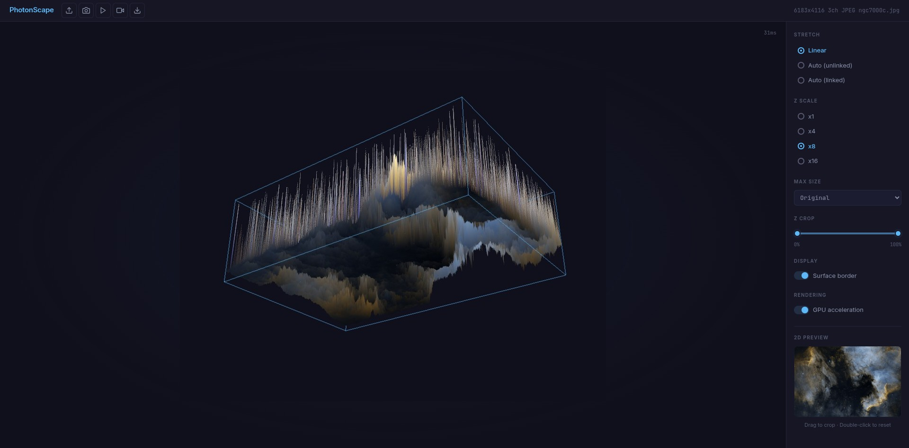

# PhotonScape

Interactive 2.5D surface viewer for astrophotography images. Pixel brightness becomes height — turning flat images into explorable 3D landscapes.



## Why?

In astrophotography, a 2D image can hide what's really going on. Noise looks fine until you see it as a jagged surface. Gradients become visible as tilted planes. Stacking improvements become obvious as the surface smooths out.

PhotonScape gives you a height map representation of your image, where brightness = elevation. This makes it much easier to understand how processing steps like stacking, gradient correction, color calibration, denoising, and star removal actually transform your data — especially if you're just starting out.

## Install & Run

### Docker

```
docker build -t photonscape .
docker run --rm -p 8182:8182 photonscape
```

With NVIDIA GPU:

```
docker run --rm --gpus all -p 8182:8182 photonscape
```

### pip

```
pip install -e .
photonscape
```

Requires Python 3.10+.

Opens in browser at `http://localhost:8182`. No CLI arguments — all configuration is in the UI.

## Supported formats

| Format | Library | Notes |
|--------|---------|-------|
| FITS (.fits, .fit) | astropy | Auto-detects Bayer pattern (BAYERPAT/COLORTYP headers) for debayering |
| TIFF (.tiff, .tif) | tifffile | Handles channel-first layout, 16/32-bit depth |
| PNG (.png) | Pillow | Standard 8/16-bit |
| JPEG (.jpg, .jpeg) | Pillow | Standard 8-bit |

## How stacking looks in 2.5D

Stacking is the core technique in astrophotography — combining multiple exposures to improve signal-to-noise ratio. In a flat 2D view, the difference between 10 and 100 stacked frames can be subtle. In 2.5D, it's obvious: the surface goes from rough and noisy to smooth and defined.

<video src="https://github.com/user-attachments/assets/02224985-4a8f-4250-9a42-2e7724cb4b5d" controls width="800"></video>

*1 → 2 → 5 → 10 → 24 → 50 → 100 → 200 stacked frames. Notice how the noise floor flattens and signal structures become cleaner with each step.*

## How processing looks in 2.5D

A typical astrophotography workflow involves multiple processing steps. Here's what they look like as 3D surfaces:

<video src="https://github.com/user-attachments/assets/021e6cdb-bc67-489f-a8a5-5d516c690450" controls width="800"></video>

- **Background extraction (BGE)** — initial image has a gradient (tilted surface). After gradient correction, the background flattens — though the resulting image appears greenish, which is expected before color calibration
- **Color calibration (SPCC)** — Spectrophotometric Color Calibration restores natural colors. In 2.5D, the surface shape doesn't change much, but the color texture shifts to represent true star and nebula colors
- **Sharpening** — star spikes become more defined in the 2D view. In 2.5D, the difference is minimal — sharpening mostly affects local contrast, not the overall elevation profile
- **Denoising** — the noise at the background (the bottom of the surface) gets tightened — the floor becomes smoother and more uniform
- **Star removal** — stars are reduced, but some spikes remain. These aren't stars — they're galaxies and other extended objects that the star removal algorithm correctly preserved

## Interface

### Header toolbar

| Button | Function |
|--------|----------|
| **Open file** | Load an image (FITS, TIFF, PNG, JPEG). Also supports drag-and-drop anywhere on the page |
| **Screenshot** | Export the current 3D view as PNG or JPG (with quality slider for JPG) |
| **Rotate** | Start/stop automatic turntable rotation |
| **Record video** | Render a turntable video (MP4) with configurable duration, FPS, rotation speed, and quality |
| **Export scene** | Download current scene parameters as JSON (camera angles, stretch, z-scale, crop, etc.) for use in external scripts |

The right side of the header shows image metadata: resolution, channel count, format, filename, and Bayer pattern if detected.

### Sidebar controls

**Stretch** — how raw pixel values are mapped to brightness:
- *Linear* — direct mapping, no transformation. Best for already-processed images
- *Auto (unlinked)* — automatic midtone stretch applied independently per channel. Reveals faint details but may shift colors
- *Auto (linked)* — same stretch parameters averaged across all channels. Preserves color balance while revealing detail

**Z Scale** — vertical exaggeration factor (x1, x4, x8, x16). Higher values make surface features more dramatic. Default is x8.

**Max Size** — downsampling limit for the loaded image (Original, 4096px, 2048px, 1024px, 512px). Lower values render faster. Useful for large FITS files.

**Z Crop** — dual-range slider that clips the surface vertically by brightness percentage. Useful for removing bright star peaks to focus on faint nebula structure, or cutting the noise floor.

**Display** — toggle the wireframe bounding box around the surface.

**Rendering** — GPU acceleration toggle (only shown when an NVIDIA GPU is detected). Uses EGL offscreen rendering when enabled.

### 2D Preview

Small reference view of the loaded image in the bottom-right. Drag on it to select a crop region (shown with a dashed red rectangle). The 3D view updates to show only the cropped area. Double-click to reset the crop.

### 3D Viewport

- **Drag** to rotate the camera around the surface
- **Scroll** to zoom in/out
- **Render time** shown in the top-right corner

## License

MIT
